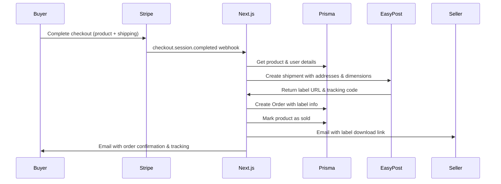
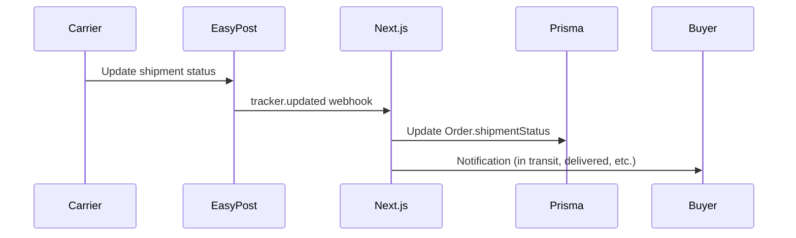

# Platform-Ships Model Implementation

## Overview

ButterGolf uses a **Platform-Ships** model where the platform handles all shipping logistics through EasyPost. When a buyer checks out, the shipping cost is included in the total payment. After successful payment, the platform automatically generates a prepaid shipping label.

This model is similar to eBay/Depop - sellers receive a prepaid label, attach it to the parcel, and drop it off. The platform owns the shipping flow including tracking, refunds, and status updates.

## Architecture

### Database Schema

The implementation adds three new models to the Prisma schema:

1. **Address** - Stores shipping addresses for users
   - Used for both "from" (seller) and "to" (buyer) addresses
   - Links to User model

2. **Order** - Represents a completed transaction
   - Links buyer, seller, and product
   - Stores payment info from Stripe
   - Stores shipping label and tracking info from EasyPost
   - Tracks order lifecycle status

3. **Product** (updated) - Added shipping dimensions
   - length, width, height (in cm)
   - weight (in grams)
   - Used by EasyPost to calculate shipping rates

### Enums

- **ShipmentStatus**: Tracks package delivery status
  - PENDING, PRE_TRANSIT, IN_TRANSIT, OUT_FOR_DELIVERY, DELIVERED, RETURNED, FAILED, CANCELLED

- **OrderStatus**: Tracks order lifecycle
  - PAYMENT_CONFIRMED, LABEL_GENERATED, SHIPPED, DELIVERED, CANCELLED, REFUNDED

## Integration Flow

### 1. Checkout Flow



### 2. Shipping Status Updates



## API Endpoints

### Stripe Webhook

**POST** `/api/stripe/webhook`

Handles Stripe checkout completion:
- Verifies webhook signature
- Extracts order metadata (productId, sellerId, buyerId)
- Creates shipping addresses
- Generates EasyPost label
- Creates Order record
- Marks product as sold

### EasyPost Webhook

**POST** `/api/easypost/webhook`

Handles EasyPost tracking updates:
- Verifies webhook signature (HMAC-SHA256)
- Processes tracker.created, tracker.updated events
- Updates Order.shipmentStatus
- Updates timestamps (shippedAt, deliveredAt)

### Orders API

**GET** `/api/orders`

Lists user's orders with optional filters:
- Query params: `role` (buyer/seller/all), `status`
- Requires authentication (Clerk)
- Returns orders with product, user, and address details

**GET** `/api/orders/[id]`

Gets single order details:
- Requires authentication (Clerk)
- Validates user is buyer or seller
- Returns full order details with tracking info

## Environment Variables

```bash
# Stripe
STRIPE_SECRET_KEY=sk_test_...
STRIPE_WEBHOOK_SECRET=whsec_...
NEXT_PUBLIC_STRIPE_PUBLISHABLE_KEY=pk_test_...

# EasyPost
EASYPOST_API_KEY=EZTEST...  # Use EZTEST for sandbox, EZAK for production
EASYPOST_WEBHOOK_SECRET=...  # Optional, for webhook verification
```

## Testing

### EasyPost Sandbox

1. Sign up at https://www.easypost.com/
2. Get your test API key (starts with `EZTEST`)
3. Use test addresses from EasyPost docs
4. Test label generation and tracking

### Stripe Testing

1. Use Stripe test mode
2. Test card: 4242 4242 4242 4242
3. Any future expiry date
4. Any CVC

### Webhook Testing

Use ngrok or similar to expose localhost:

```bash
# Start ngrok
ngrok http 3000

# Configure webhooks
Stripe: https://your-ngrok-url/api/stripe/webhook
EasyPost: https://your-ngrok-url/api/easypost/webhook
```

## Error Handling

### Failed Label Generation

If EasyPost label generation fails:
- Order is still created with status PAYMENT_CONFIRMED
- Admin is notified (TODO)
- Label can be generated manually later

### Webhook Failures

Both webhook handlers return proper status codes:
- 400: Invalid signature or missing data
- 401: Unauthorized
- 404: Resource not found
- 500: Server error

Webhooks are idempotent - duplicate events are handled safely.

## Security

1. **Webhook Signatures**: All webhooks verify signatures
   - Stripe: Uses svix library
   - EasyPost: HMAC-SHA256 verification

2. **Authentication**: All order APIs require Clerk authentication

3. **Authorization**: Users can only view their own orders (as buyer or seller)

4. **Environment Variables**: All secrets stored in env vars, never committed

## Next Steps

### UI Components (TODO)

1. **Seller Dashboard**
   - List orders where user is seller
   - Download/print shipping label button
   - View order details
   - Mark as shipped button

2. **Buyer Dashboard**
   - List orders where user is buyer
   - View tracking information
   - Live tracking status
   - Delivery confirmation

3. **Checkout Flow**
   - Add shipping address form
   - Calculate shipping cost
   - Create Stripe checkout session
   - Redirect to success page with order ID

### Notifications (TODO)

1. **Email Templates**
   - Order confirmation (buyer)
   - Shipping label ready (seller)
   - Package shipped (buyer)
   - Package delivered (buyer & seller)

2. **In-App Notifications**
   - Real-time status updates
   - Push notifications for mobile app

## Troubleshooting

### Label generation fails

- Check EasyPost API key is valid
- Verify addresses are complete and valid
- Check product has dimensions set
- Review EasyPost logs in dashboard

### Tracking not updating

- Check EasyPost webhook is configured correctly
- Verify webhook secret matches
- Check carrier is providing updates
- Some carriers have delays in tracking data

### Orders not appearing

- Verify Stripe webhook is configured
- Check webhook signature verification
- Review server logs for errors
- Ensure database migration ran successfully

## Resources

- [EasyPost API Documentation](https://www.easypost.com/docs/api)
- [Stripe Checkout Documentation](https://stripe.com/docs/payments/checkout)
- [Stripe Webhooks Guide](https://stripe.com/docs/webhooks)
- [EasyPost Webhook Guide](https://www.easypost.com/docs/api#webhooks)
